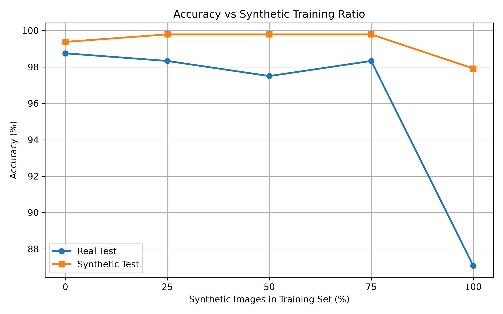

# Могут ли синтетические изображения использоваться для обучения и оценки моделей классификации компьютерного зрения?

## Описание проекта

Идея проекта появилась во время сбора данных для совершенно другого проекта. Проблема заключалась в недостаточном количестве нужных мне фотографий для обучения модели компьютерного зрения, предназначенной для классификации изображений. Я решил, что, раз нужные фотографии нигде не найти, почему бы не сгенерировать их с помощью современных нейросетей, которые на момент написания статьи уже довольно быстро и качественно умеют создавать изображения по текстовому запросу.

Но передо мной сразу встало несколько вопросов: повлияет ли обучение на синтетических данных на качество модели? Сколько синтетических данных в процентном соотношении к реальным можно использовать, не теряя качества? А позже появился ещё один вопрос: а что, если проверять качество модели на синтетических данных?

Все эти вопросы в итоге вылились в исследование, которое вы сейчас читаете.

## Структура репозитория

### `metadata/`

* **eX_train.csv** — информация о составе обучающей выборки для эксперимента **X** (какие изображения из `dataset_real` и `dataset_synthetic` вошли в эксперимент).
* **experiment_config.json** — параметры генерации синтетических изображений и используемая генеративная модель.
* **prompt_templates.csv** — промпты, использованные для генерации синтетических изображений. Для каждого промпта в `dataset_synthetic` было сгенерировано ровно **30 изображений**.

---

### `results/`

* **summary.csv** — итоговые результаты всех экспериментов. Содержит значения Accuracy, Precision, Recall и F1-score для оценки моделей на реальных и синтетических тестовых выборках.
* **accuracy_vs_synthetic_ratio.png** — график зависимости точности классификации от доли синтетических изображений в обучающей выборке.
* **domain_gap.png** — график, показывающий разницу между качеством модели на реальной и синтетической тестовых выборках (Domain Gap).

---

### `scripts/`

* **analysis.py** — строит итоговые графики исследования и сохраняет их в папку `results/`.
* **create_experiment_datasets.py** — формирует файлы `eX_train.csv`, описывающие состав обучающей выборки для каждого эксперимента.
* **evaluate_model.py** — оценивает обученные модели на тестовых выборках и вычисляет метрики Accuracy, Precision, Recall и F1-score.
* **prompt_generator.py** — генерирует файл `prompt_templates.csv`. Поскольку генерация промптов происходит случайным образом, для полного воспроизведения исследования необходимо использовать именно сохранённый файл `prompt_templates.csv`.
* **train_model.py** — обучает модель EfficientNet-B0. Во всех экспериментах использовалось **10 эпох обучения**.

---

### `models/`

Обученные модели (в формате `.pth`), использованные в исследовании. В репозиторий не включены из-за большого размера.

Скачать можно **[здесь](https://drive.google.com/drive/folders/1GEVB_Aca4CIIrR2jtpXbsZpjqSJFDK1S?usp=drive_link)**.

---

### `dataset_real/`

Реальные изображения, использованные в исследовании.

* **Оригинальный датасет:** [Kaggle](https://www.kaggle.com/datasets/balabaskar/wonders-of-the-world-image-classification)
* **Версия, использованная в исследовании:** [Google Drive](https://drive.google.com/drive/folders/11YW_KtlKP1D3d573jAoHfc7VIA0A4fya?usp=drive_link)

---

### `dataset_synthetic/`

Синтетические изображения, сгенерированные по промптам из `prompt_templates.csv`.

Скачать можно **[здесь](https://drive.google.com/drive/folders/1c44V4vUV0VAcN55aXytl7Jpp0mgrDWec?usp=drive_link)**.

## Использованные данные

В качестве исходного датасета был выбран **Wonders of the World Image Dataset**, поскольку он содержит достаточное и при этом не слишком большое количество изображений для каждого класса. Это позволило провести все эксперименты локально на одном компьютере (в моём случае использовалась видеокарта **NVIDIA RTX 3060** с **12 GB VRAM**).

Кроме того, изображения в датасете уже достаточно хорошо очищены и не требуют дополнительной ручной фильтрации перед использованием. Ещё одним преимуществом стало то, что выбранные объекты являются всемирно известными достопримечательностями, поэтому современные генеративные модели способны достаточно качественно воспроизводить их по текстовым описаниям.

| Датасет                           | Количество изображений |
| --------------------------------- | ---------------------: |
| Реальные изображения (train)      |                   2357 |
| Реальные изображения (validation) |                    240 |
| Реальные изображения (test)       |                    240 |
| Синтетические изображения (train) |                   2400 |
| Синтетические изображения (test)  |                    480 |

## Эксперименты

Всего было проведено **5 основных экспериментов**, каждый из которых дополнительно оценивался на двух независимых тестовых выборках: **реальных** и **синтетических** изображениях. Во всех экспериментах использовались одинаковая архитектура модели, одинаковые параметры обучения и одинаковые тестовые выборки. Единственным изменяемым параметром было процентное соотношение реальных и синтетических изображений в обучающей выборке.

| Эксперимент | Реальные изображения | Синтетические изображения |
| ----------- | -------------------: | ------------------------: |
| **E1**      |                 100% |                        0% |
| **E2**      |                  75% |                       25% |
| **E3**      |                  50% |                       50% |
| **E4**      |                  25% |                       75% |
| **E5**      |                   0% |                      100% |

Такой подход позволил оценить, как постепенная замена реальных изображений синтетическими влияет на качество модели, а также проверить, насколько результаты оценки на синтетических тестовых данных отличаются от оценки на реальных изображениях.

## Как воспроизвести результаты

1. Клонируйте репозиторий.
2. Установите необходимые зависимости с помощью файла `requirements.txt`.
3. Скачайте папки `dataset_real`, `dataset_synthetic` и `models` по ссылкам, приведённым выше, и поместите их в корневую директорию проекта.
4. При необходимости сформируйте файлы экспериментов с помощью `create_experiment_datasets.py`.
5. Запустите обучение модели с помощью `train_model.py` (или используйте уже обученные модели из папки `models`).
6. Выполните оценку моделей с помощью `evaluate_model.py`.
7. Постройте итоговые графики, запустив `analysis.py`.

После выполнения всех шагов будут получены результаты каждого отдельного эксперимента, на основе которых можно сформировать итоговую таблицу `summary.csv`. Скрипт `analysis.py` использует этот файл для построения графиков, представленных в исследовании.

## Архитектура модели

Для генерации синтетических изображений использовалась модель **Juggernaut XL v9**. Полный список параметров генерации (качество изображения, количество шагов и другие настройки) приведён в файле `metadata/experiment_config.json`.

Для обучения использовалась свёрточная нейронная сеть **EfficientNet-B0** с предобученными весами **ImageNet**, что позволило ускорить сходимость модели и обеспечить более стабильные результаты экспериментов.

Во всех экспериментах использовались одинаковые параметры обучения:

* размер входного изображения — **224×224** пикселя;
* количество эпох — **10**;
* размер батча — **32**;
* оптимизатор — **AdamW**;
* скорость обучения (*Learning Rate*) — **1×10⁻⁴**;
* функция потерь — **CrossEntropyLoss**.

Единственным изменяемым параметром во всех экспериментах было соотношение реальных и синтетических изображений в обучающей выборке.

### Зависимость точности модели от доли синтетических изображений

На данном графике представлена зависимость точности классификации (**Accuracy**) от доли синтетических изображений в обучающей выборке. Синяя линия показывает результаты оценки модели на реальной тестовой выборке, а оранжевая — на синтетической.

По синей линии видно, что при увеличении доли синтетических изображений в обучающей выборке до **75%** качество модели практически не ухудшается. Однако при полном переходе на синтетические данные (эксперимент **E5**) точность на реальной тестовой выборке снижается более чем на **10 процентных пунктов** по сравнению с экспериментом **E4**, что свидетельствует о заметном ухудшении способности модели работать с реальными изображениями.

Оранжевая линия показывает, что во всех экспериментах оценка модели на синтетической тестовой выборке оказывается выше, чем на реальной. Это говорит о том, что синтетические тестовые данные систематически переоценивают качество модели и не могут полностью заменить реальные данные при её оценке.
